## CSS Shapes!

### Squares and Rectangles

* Squares and rectangles are fairly straight-forward. We simply give and element a `height` and a `width` and it's rectangular shaped. If the `width` and `height` are the same, we get a square, otherwise we get a rectangle.

  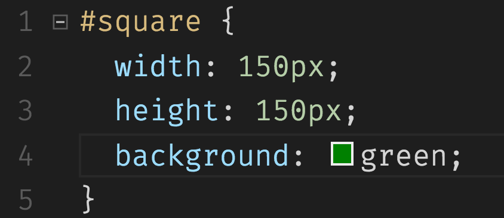
  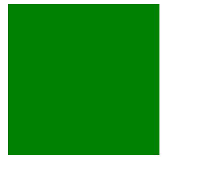

### Circles and Ovals

* Circles and ovals are less obvious. To make an element round, we adjust it's `border-radius` property. An element with equal height, equal width, and a `boder-radius` of 50%.

  
  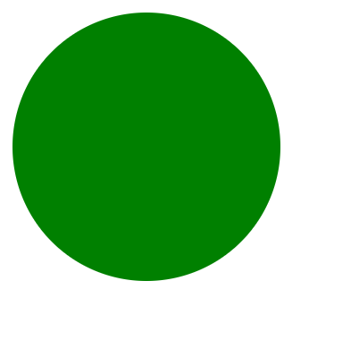

* To make an element an oval, we just change it's height or width so they're different.

  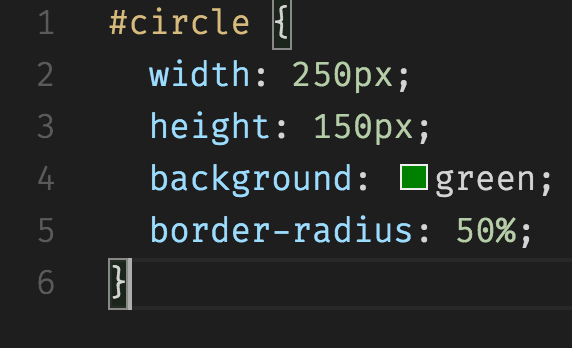
  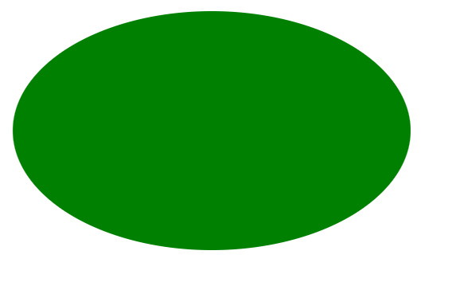

### Triangles

* This is possible the most difficult to understand CSS shape. Here it would be easier to show you how it can be done before trying to explain.

  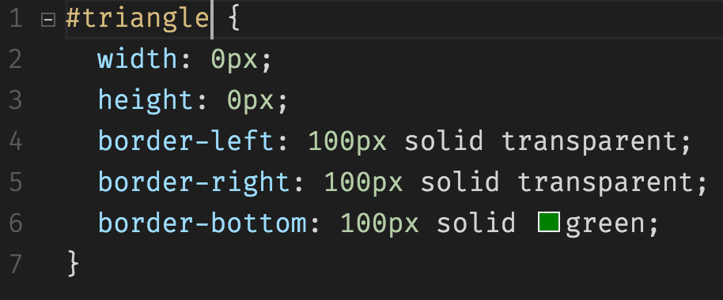
  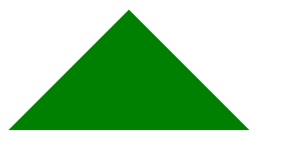

* Every HTML element has 4 borders (even if we don't style them), regardless of it's shape: left, top, right, and bottom. We can see this is the case if we were to inspect the triangle in Chrome inspector:

  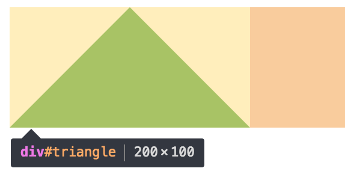

* Here we can see the rectangular outline of the triangle div.

* **Q: Okay, it's a square, but how do we make it look like a triangle?**
  * **A: We give the element a `height` and `width` of 0, and give define three borders and set the length for each. Two of the borders are transparent. One border has a color. 

  * Essentially what's happening is because the element **wants** to be a square, but we've set its `height` and `width` to 0, **but** we've given the borders a length, we get a shape that's only it's borders, which want to connect in the middle. 

  * Can you tell why we only gave one of the borders a color and made the rest transparent?

    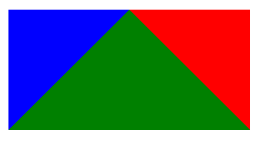

  * Let's see what happens when we add the fourth border and color it in:

    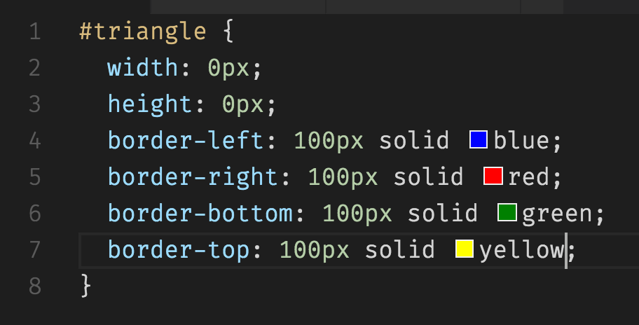
  
    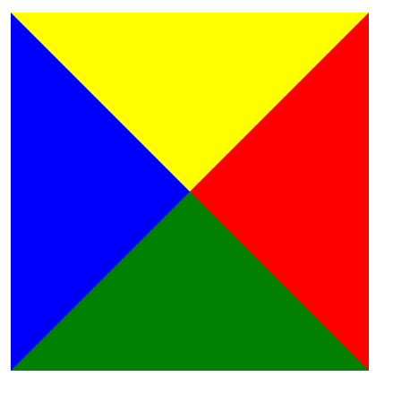
  
  * You can adjust the triangle's angles by changing the lengths of the different borders. You only need to style 3 borders for this to work, just include make sure the border you'd like to set as the base of your triangle is colored in!
